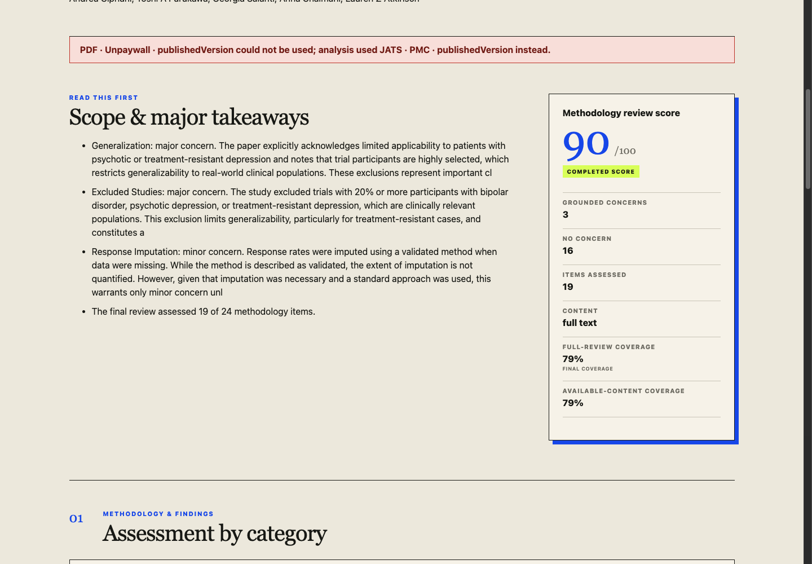

# Sloppy Paper Checker

[](https://github.com/zakhar-kogan/sloppy-paper-checker/actions/workflows/ci.yml)
[](LICENSE)

Sloppy Paper Checker reviews the methodology of scientific papers and shows the evidence behind each assessment. Give it a DOI, PMID, PMCID, arXiv record, scholarly URL, or PDF, and it produces a structured report with quotations, source provenance, coverage gaps, and an auditable score.

Use the score to navigate the report alongside its evidence, coverage, and limitations.

[Use the live application](https://papers.teleogenic.com/).



## What it does

- Resolves paper metadata and available full-text sources through Crossref, Unpaywall, and NCBI.
- Selects tailored review criteria for randomized trials, observational studies, systematic reviews, computational research, and general empirical papers.
- Separates evidence collection from final assessment: specialist workers find relevant passages, then a reviewer grades the applicable criteria.
- Verifies quotations against the normalized paper before including them as evidence.
- Preserves unavailable or failed checks with an explicit unassessed status.
- Records the methodology, parser, models, coverage, token usage, source context, and canonical DOI/arXiv/PubMed links used for each report.
- Keeps reports private by default. A user can select automatic 30-day publication before analysis, publish later, or unpublish early.
- Offers an existing compatible review before spending inference quota: private reviews only within their owner session, and public identifier-based reviews across visitors while published.
- Keeps a submitted or retrieved PDF available in a collapsible viewer only for the lifetime of the current browser tab.

For a representative full-text test, try `10.1016/S0140-6736(17)32802-7`.

## How it works

The web app parses PDFs with PDF.js. PMC JATS documents are normalized by the FastAPI backend. The resulting text and document structure are stored temporarily while Agno workers and a final reviewer analyze the paper through a configurable OpenAI-compatible API. Nebius Token Factory is the default provider. Progress is saved in the database and displayed by polling, so reports survive page reloads.

Local development uses SQLite, filesystem storage, and analysis running in the FastAPI process. The current public deployment uses a small single-host Compose stack with PostgreSQL and inline analysis. The same backend can instead dispatch each analysis to a Nebius Serverless Job backed by managed PostgreSQL and S3-compatible Object Storage; storage and dispatch choices are configured independently.

The static frontend is already CDN-deployable, and the API, storage, and dispatcher boundaries preserve a future move to serverless infrastructure without changing the report contract. Serverless analysis jobs are supported today. Replacing the small stateful FastAPI control plane with a fully scale-to-zero backend would still require different session and persistence adapters and is intentionally not part of the current deployment.

See [Architecture and trust boundaries](docs/architecture.md) for the complete data flow.

## Data handling

PDF.js parses local PDFs in the browser and sends the extracted text and document structure to the API. For papers discovered online, the API relays the PDF to the browser for the same parsing step. The backend fetches and normalizes PMC JATS content directly.

Private reports and leftover documents expire after 24 hours by default. Public reports expire after 30 days and may be unpublished sooner. An idempotent hourly cleanup removes expired terminal analyses, stale source-resolution records, and unreferenced stored documents. Reports are scoped to the anonymous browser session that created them unless explicitly published; original PDFs are never published or retained merely for viewing.

The configured model provider receives paper content during analysis. Choose a deployment and provider whose data-handling policies are appropriate for the material you submit.

## Local development

Requirements:

- Python 3.12–3.14 and [uv](https://docs.astral.sh/uv/)
- Node.js 22.12 or later and npm
- An API key for an OpenAI-compatible model provider; Nebius Token Factory is the default

Create the environment file and set the provider credentials and contact emails:

```bash
cp .env.example .env
```

Start the API in local mode:

```bash
env UV_CACHE_DIR=/tmp/uv-cache \
  SPC_ENV=development \
  SPC_DATABASE_URL=sqlite:///./paper_checker.db \
  SPC_DOCUMENT_STORE=filesystem \
  SPC_DOCUMENT_STORE_PATH=./data/documents \
  SPC_ANALYSIS_DISPATCHER=inline \
  uv run --project backend --env-file .env \
  uvicorn sloppy_checker.main:app --app-dir backend/src \
  --host 127.0.0.1 --port 8787
```

In another terminal, start the web app:

```bash
npm --prefix web ci
npm --prefix web run dev -- --host 127.0.0.1
```

Open `http://127.0.0.1:5173`. The API documentation is available at `http://127.0.0.1:8787/docs` in development mode.

Model inference is configured with `SPC_PROVIDER_BASE_URL`, `SPC_PROVIDER_API_KEY`, `SPC_PROVIDER_WORKER_MODEL`, and `SPC_PROVIDER_REVIEWER_MODEL`. The defaults target Nebius Token Factory. Existing `SPC_NEBIUS_API_KEY` and `SPC_TOKEN_FACTORY_*_MODEL` settings remain supported as fallbacks.

## Docker Compose

The included Compose stack runs three long-lived services on one host: Caddy serves the compiled Preact frontend and proxies API traffic, FastAPI runs the application and inline analysis, and PostgreSQL stores durable state. A one-shot initialization container prepares the persistent document volume and exits. Copy `.env.example` to `.env`, replace the placeholder API token, configure the provider key and contact emails, then run:

```bash
docker compose up --build
```

This deployment uses inline analysis and a persistent local document volume. For a distributed Nebius deployment using Managed PostgreSQL, Object Storage, MysteryBox, and Serverless Jobs, follow the [Nebius deployment guide](docs/nebius.md).

The live Compose frontend includes both the curated example gallery and live analysis. Public-beta spending is bounded by a configurable per-browser allowance, a server-side global safety cap, one concurrent analysis per browser, and the emergency `SPC_LIVE_ANALYSIS_ENABLED` switch. The current example configuration allows ten hosted analyses per browser in a rolling 24-hour window. Visitors see whether hosted analysis is available, not the global remaining count; compatible existing reports remain accessible when fresh capacity is exhausted.

Optional OTLP/HTTP tracing is disabled by default. When enabled, its allowlist is limited to operational metadata such as stages, model identifiers, timings, token counts, coverage, and outcomes.

## Verification

```bash
make test
make lint
make build
make openapi
```

CI runs the repository test suites, checks backend and web linting, builds the web app, and verifies that the committed OpenAPI schema is current. PostgreSQL contract tests also run when `SPC_TEST_POSTGRES_URL` is set.

## Documentation

- [Architecture and trust boundaries](docs/architecture.md)
- [Deployment options and agent runbook](DEPLOYMENT.md)
- [Scoring methodology](docs/scoring.md)
- [Evidence sources](docs/data-sources.md)
- [Limitations and responsible interpretation](docs/limitations.md)
- [Nebius deployment](docs/nebius.md)
- [Contributing](CONTRIBUTING.md)
- [Security policy](SECURITY.md)

Licensed under the [MIT License](LICENSE).
