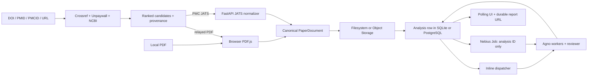

# Architecture and trust boundaries

Each infrastructure concern is configured independently. There is no generic cloud flag: tests can combine a SQL repository, filesystem/S3 document store, and inline/mocked Nebius dispatcher in any supported arrangement.

The browser parses local and relayed PDFs; PDF bytes are never posted to the API. PMC JATS is normalized by FastAPI. Only a validated canonical document is stored for analysis. Resolved candidate URLs are represented by opaque IDs cached in SQL with an expiry, so the relay never accepts a caller-supplied destination.

SQLite is deliberately single-process and local. Nebius jobs require PostgreSQL and S3 storage; startup validation rejects SQLite or filesystem storage with `nebius_job`.

The job specification contains the analysis ID, non-secret adapter coordinates, image and model IDs. PostgreSQL, Object Storage, and model-provider credentials are MysteryBox references. The job loads the document by ID, runs the same Agno engine as inline mode, and updates PostgreSQL. FastAPI remains the owner of sessions, resolution, lifecycle access control, and reports.

Agno is intentionally narrow: `Agent` and `OpenAILike` provide structured model calls through an operator-configured OpenAI-compatible API, with Nebius Token Factory as the default. Scheduling, persistence, source resolution, and scoring are ordinary application code. The unused Agno `Workflow` factory was removed.

Analysis progress is stored as safe stage and module events in the existing analysis JSON event field. The polling status contract exposes labels, completion state, evidence-note counts, bounded observations, and short exact-quote previews verified against the canonical document; it never exposes prompts, the complete paper, raw model output, or credentials. Deterministic routing only selects likely chunks; Agno workers interpret evidence and the Agno reviewer assigns judgments. Reviewer execution has a total deadline; timeout or provider failure produces an explicitly provisional, unreviewed report rather than leaving the lifecycle running indefinitely.

Anonymous sessions use an HttpOnly SameSite cookie; production cookies are Secure. Reports and canonical documents are owner-scoped. Native logs and report audit fields work without additional services. Optional OTLP/HTTP tracing is disabled by default and exports only allowlisted identifiers, model names, timings, token counts, coverage, and outcomes; it is compatible with Langfuse collectors without adding a Langfuse SDK.
