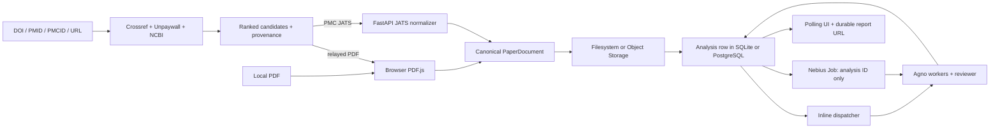

# Architecture and trust boundaries

Each infrastructure concern is configured independently. There is no generic cloud flag: tests can combine a SQL repository, filesystem/S3 document store, and inline/mocked Nebius dispatcher in any supported arrangement.

The browser parses local and relayed PDFs; PDF bytes are never posted to the API. PMC JATS is normalized by FastAPI. Only a validated canonical document is stored for analysis. Resolved candidate URLs are represented by opaque IDs cached in SQL with an expiry, so the relay never accepts a caller-supplied destination.

SQLite is deliberately single-process and local. Nebius jobs require PostgreSQL and S3 storage; startup validation rejects SQLite or filesystem storage with `nebius_job`.

The job specification contains the analysis ID, non-secret adapter coordinates, image and model IDs. PostgreSQL, Object Storage, and Token Factory credentials are MysteryBox references. The job loads the document by ID, runs the same Agno engine as inline mode, and updates PostgreSQL. FastAPI remains the owner of sessions, resolution, lifecycle access control, and reports.

Agno is intentionally narrow: `Agent` and `OpenAILike` provide structured model calls. Scheduling, persistence, source resolution, and scoring are ordinary application code. The unused Agno `Workflow` factory was removed.

Anonymous sessions use an HttpOnly SameSite cookie; production cookies are Secure. Reports and canonical documents are owner-scoped. Native Nebius logs plus report audit fields are the initial observability layer; vendor tracing is deferred until concrete debugging needs justify it.
