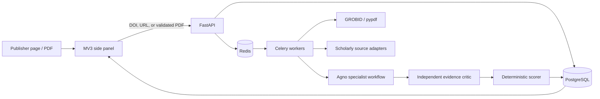

# Architecture and trust boundaries

The pipeline is: ingest and fingerprint → structured extraction → paper-type classifier and rubric planner → parallel specialist checks → independent evidence critic → deterministic scorer → persisted report.

Paper text is untrusted data. It is delimited from model instructions, cannot select tools, and cannot alter the output schema. The extension has no permanent `<all_urls>` access: a PDF origin is requested only during capture and removed immediately afterward. Local, `blob:`, authenticated/single-use, POST-backed, inaccessible, and non-PDF responses fall back to explicit upload.

The backend rejects non-HTTP URL schemes, URL credentials, localhost/private/link-local/reserved destinations, and hosts that resolve to non-global addresses. It does not automatically follow redirects. Uploads are streamed with a hard size limit, checked by MIME declaration and PDF magic bytes, randomly named, page-limited, and deleted after extraction. Full extracted text is discarded after analysis; only report data and cited snippets remain.

All `/v1` routes require one bearer token. Provider API keys remain server-side and are encrypted with Fernet; an environment key overrides stored credentials. Production deployments must set a stable `SPC_ENCRYPTION_KEY`, a long `SPC_API_TOKEN`, and appropriate `SPC_ALLOWED_HOSTS`. CORS is disabled unless explicitly configured.

The Agno workflow uses OpenAI-compatible `OpenAILike` models, parallel typed specialist steps, and a critic step. Standard mode runs independent specialists concurrently; advanced sequential mode trades latency for predictable provider load. The deterministic offline baseline is deliberately conservative when no model is configured.

